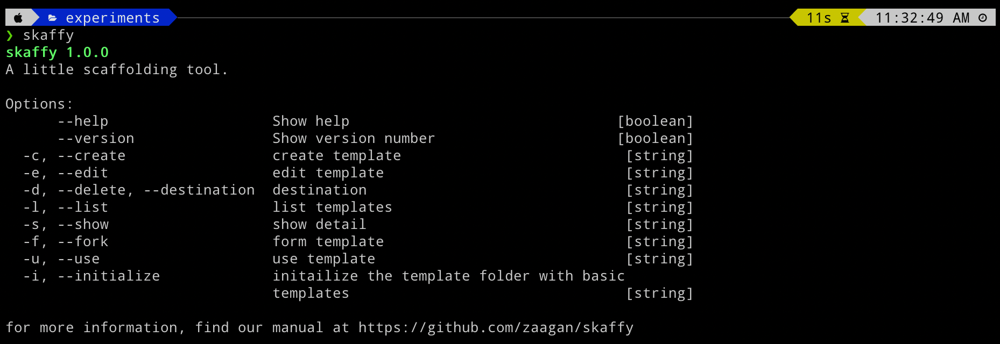
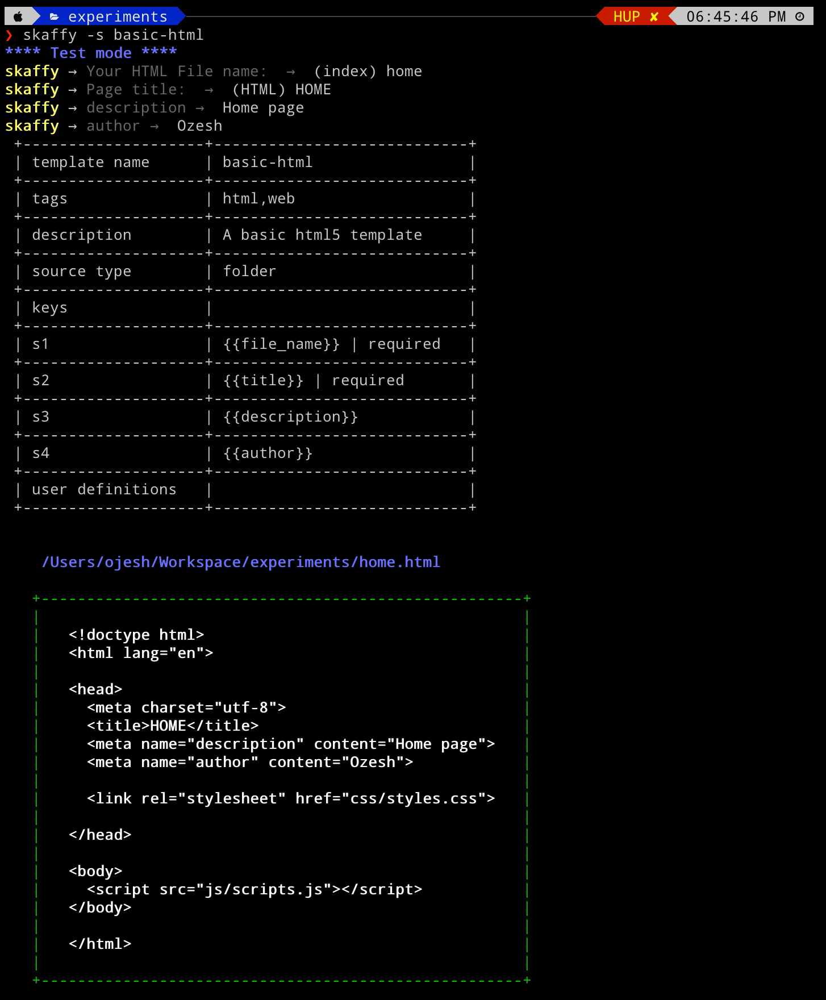

# skaffy
A simple little boilerplate generator for rapid development

Are you tired of creating the same structure of files and directories, then copying the same old snippets to those files again and again ??

Here is what you can do:
<br />

**Create boilerplates > Save it > Re-use it again a million times !!**

<br />

# Try it out !!


```
$ npm install skaffy -g  # install it globally
$ skaffy -l t # list existing templates
$ skaffy -u <template-name>  # use a template
$ skaffy -s <template-name>  # preview a templates output
```


 <br />

# Features

- Craft and re-use boilerplates instantly
- Preview a templates output before deploying 
- Fork templates from a directory or a repo (Coming soon...).


<br />

# What are boiler plates ?

Boilerplates are repeated pieces of code, distribtued in one or more files and directories while possessing similar structures.

You can find them anywhere in any programing language. Mainly in structures that follow a definite **software design pattern**.


**Here is a quick example:**

```
└─── Controllers
     ├──── PotatoController.cs
└─── Models
     ├──── PotatoModels.cs
└─── Views
     └─── Potato
          ├──── Potato.aspx
          ├──── PotatoSuccess.aspx
└─── Scripts
     ├──── Potato.js
└─── Styles     
     ├──── Potato.css
```


These kinds of patterns can be found in almost any programming language or software components, from Ruby on Rails to .NET MVC to your typical React, Vue or Angular component.

<br />

# Step by Step


Using skaffy is as simple as the following steps:

 <br />

## Step 1

Install **skaffy** on your working machine.

```bash
$ npm install skaffy
```

 <br />

## Step 2

Initialize your `skaffy_templates` directory.  *(This is where skaffy stores all your boilerplates)* 

```bash
$ skaffy
```

On the first run, skaffy will  try to initialize itself by setting up a templates directory and loading existing samples templates in that directory.

It  will ask you for a path to store your templates as shown in the image below. 

If you do not provide a storage path, skaffy automatically assignes a default storage path (i.e the your home folder).

You can leave it as default or update it later on. *( Pressing enter and moving forward is recommended for now )*

 <br />

**Here is how the procedure looks like:**


Running skaffy for the first time will automatically execute the following command:

```bash
$ scaff -i new
```

Scaffy comes with a number of pre-defined templates as samples which you can use or improvise upon as per your need. This command will load those templates in your templates folder at your disposal.


Once the templates folder gets initialized, you will start seeing a different message when executing the `skaffy` command.

**Something like this :**




 <br /> 

## Step 3

Since skaffy comes with a couple of commonly used boiler plates. You can instantly see it in action.


> Do check out the samples directory in the project repo to see how the templates are crafted.  


### List all the existing templates

```bash
# syntax :
$ skaffy [-l|--list] [t|templates]

# example :
$ skaffy -l t  # short approach
```

<br />


**Here is what it looks like :**


<br /> 


### Using an existing template

In order to use a template, you need to navigate to the directory where you wish to use the template. 

Once in that directory, you can execute the following command:

```bash
# syntax :
$ skaffy [-u|--use] <template-name>

# example :
$ skaffy -u basic-html  # short approach
```


**Here is how it looks like in action:**


<br />


### Preview the output before use

It is always recommended to preview the results before you use a skaffy template. 

It will provide you with the necessary insights like 
- what directories will get created, 
- where and with what names, 
- how many files will be created, 
- what will the files contain etc.


In your workspace directory where you will actually use the template, you can execute the following command:

```bash
# syntax :
$ skaffy [-s|--show] <template-name>

# example :
$ skaffy -s basic-html  # short approach
```


**Here is how it looks like in action:**




<br />


# A basic skaffy template

A bare minimum skaffy template consists of your boilerplate files (optional) and a **template.json** file that controls it.

Here is a quick look at one of the pre-existing templates folder structure **i.e** *basic-html template*

```bash
└─── skaffy_templates
    └─── basic-html
         ├──── {{file_name}}.html
         ├──── template.json
    └─── . . .
```


Here **{{file_name}}** is a template string that is replaced when the template is executed. It is defined in the `template.json` file along with rest of the other template strings that are used by the template.

The template is controlled by the `template.json` file and what ever configurations you have provided in that file.

```json
{
  "name": "basic-html",
  "pre-delimeter": "{{",
  "post-delimeter": "}}",
  "tags": [
    "html",
    "web"
  ],
  "description": "A basic html5 template",
  "keys": [
    {
      "kid": "s1",
      "name": "file_name",
      "default": "index",
      "required": true,
      "description": "Your HTML File name: "
    },
    {
      "kid": "s2",
      "name": "title",
      "default": "HTML",
      "required": true,
      "description": "Page title: "
    },
    {
      "kid": "s3",
      "name": "description",
      "default": ""
    },
    {
      "kid": "s4",
      "name": "author",
      "default": ""
    }
  ]
}
```

<br /> 


# Crafting your own skaffy boilerplate/template

Crafting a boiler plate is as simple as creating your own template folder in the   `skaffy_templates` directory and adding up a couple of files. Here is how you can do it :


**Manual approach**

1. In your `skaffy_templates` directory, start by creating a directory with a meaningful name.
   **lets say:** `potato-template`.
 
    ```bash
    └─── skaffy_templates
       └─── potato-template  #your-template-name
    ```


2. Within your template folder create a **template.json** file. 
   You can copy the template.json data from above for now and add up more template strings as per your requirements. 

   

3. Craft your template structure. Your template can be of any structure. It can be as simple as this :

    ```
    └─── skaffy_templates
         └─── potato-template 
             ├──── {{file_name}}.html
             ├──── template.json
    ```

    or
    as complex as this :

    ```
    └─── skaffy_templates
         └─── potato-template
             └─── Controllers
                  ├──── {{module_name}}Controller.cs
             └─── Models
                  ├──── {{module_name}}Models.cs
             └─── Views
                  └─── Potato
                       ├──── {{module_name}}.aspx
                       ├──── {{module_name}}Success.aspx
             └─── Scripts
                  ├──── {{module_name}}.js
             └─── Styles     
                  ├──── {{module_name}}.css
             ├──── template.json
    ```


Check out the samples folder in the project repo to get the idea of creating various types of templates as per your need.


4. Invoke skaffy and you will already find your template in the list

```bash
$ skaffy -l t  # short approach
└─── basic-html
└─── potato-template   #your template
```


5. Use your template. 
   Head over to your projects directory and use the template

```bash
$ skaffy -u potato-html
```

Thats it!!

<br />


# Included templates 
Skaffy comes with a number of pre-defined template which you can implement or improvise for your own usage.

- basic-html (A basic html5 template)
- exodus-use-case (A basic .NET Use case template that i had crafted for my personal project)
- project-management (A directory structure that can be used to organize all the files and documents for your next project)
- my-workspace (A workspace structure which I myself use to organize my personal stuffs)

<br />

# To Do

- [ ] Initialize template directory from terminal.
- [ ] Create more standard and popular templates
- [ ] Implement template forking and pulling from git repos.


